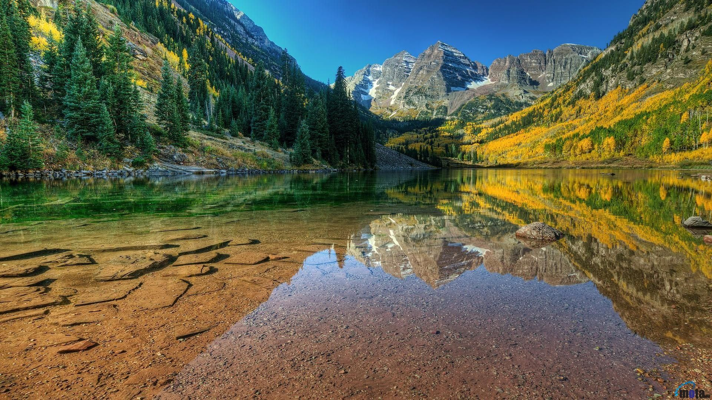

# Markdown
Project for markdown challenge

## Hi my name is Dylan Barrett

#### I am a Senior at the University of Missouri-Columbia

<http://www.dylanbarrett.me:8080>

[Second Page] (secondREADME.md)




```javascript
var s = "Hello World!";
alert(s);
```

>I enjoy making websites and working with the web development side of IT.
>I also recently started working with swift and IOS app development.

* Code 
* Eat
* Sleep 
* Repeat

1. First item on list
2. Second item on list
3. Third item on list

| Tables | In | Markdown |
|--------|----|----------|
|JavaScript |Python| C |
|Java| PHP|C#|
|HTML|CSS|ReactJS|

__bolded with asterisks__
__bolded with underscores__

*this text was italicized using asterisks*

My favorite sport is ~~basketball~~ baseball.

---